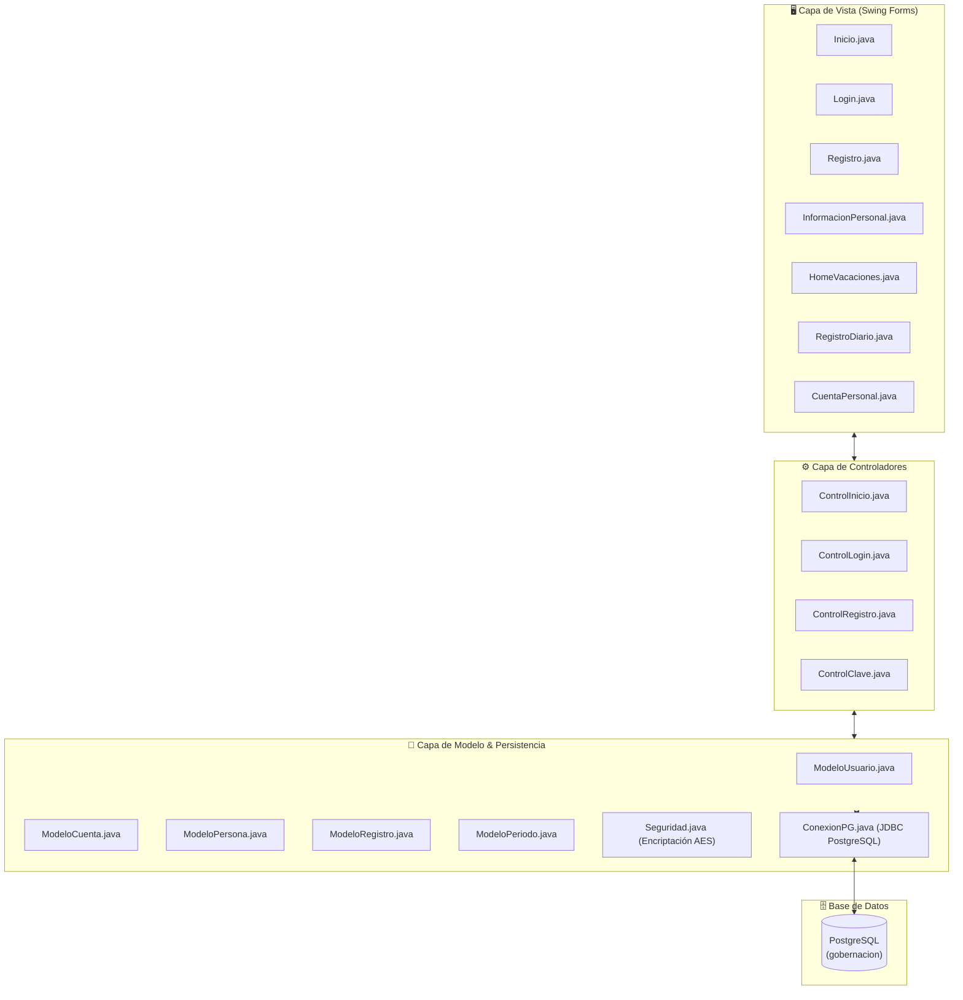

# 🏛️ Sistema de Liquidación de Funcionarios y Control de Vacaciones

[](https://www.java.com/)
[](https://www.postgresql.org/)
[](https://ant.apache.org/)
[](#)

Sistema de escritorio integral desarrollado en **Java (Swing)** bajo la arquitectura **MVC (Modelo-Vista-Controlador)** para la **Gobernación**. La aplicación automatiza y optimiza el control de asistencia diaria, gestión de personal, cálculo y liquidación de vacaciones y administración de cuentas de usuario con encriptación de datos.

---

## 📋 Tabla de Contenidos
- [Descripción General](#-descripción-general)
- [Funcionalidades Principales](#-funcionalidades-principales)
- [Arquitectura del Sistema](#-arquitectura-del-sistema)
- [Tecnologías Utilizadas](#-tecnologías-utilizadas)
- [Estructura del Proyecto](#-estructura-del-proyecto)
- [Esquema de Base de Datos](#-esquema-de-base-de-datos)
- [Seguridad y Criptografía](#-seguridad-y-criptografía)
- [Instalación y Configuración](#-instalación-y-configuración)
- [Autores](#-autores)

---

## 📌 Descripción General

El **Sistema de Liquidación de Funcionarios** permite a la institución llevar un control riguroso del talento humano. Facilita el registro preciso de las jornadas laborales, horas extras, permisos y recesos, automatizando el cálculo de los períodos vacacionales acumulados y la liquidación formal correspondiente a cada funcionario.

---

## ✨ Funcionalidades Principales

### 🔑 1. Autenticación y Control de Acceso
- **Gestión de Inicio de Sesión (Login):** Autenticación segura mediante usuario y clave.
- **Validación de Seguridad:** Control de claves de seguridad para la habilitación del registro de nuevos usuarios en el sistema.
- **Roles y Permisos:** Diferenciación de accesos entre Administradores y Funcionarios.

### 👥 2. Gestión de Información Personal
- **Registro de Funcionarios:** Formulario completo para captura de datos personales (Cédula/Identificación, Nombres, Apellidos, Teléfono, Correo, Dirección).
- **Mantenimiento de Perfiles:** Actualización, consulta y eliminación de expedientes de personal.

### ⏱️ 3. Control Diario de Asistencia y Permisos
- **Registro de Horarios:** Captura de hora de ingreso y hora de salida de la jornada laboral.
- **Control de Recesos:** Seguimiento del tiempo destinado a almuerzos o descansos.
- **Horas Extras:** Registro de horas suplementarias y extraordinarias trabajadas.
- **Gestión de Permisos:** Registro y control de horas de salida y reingreso por permisos institucionales o personales.

### 🏖️ 4. Cálculo y Liquidación de Vacaciones
- **Control de Períodos:** Registro de períodos acumulados por cada funcionario según su tiempo de servicio.
- **Cálculo Automático de Días:** Determinación automática de días generados, días tomados y saldo vacacional pendiente.
- **Generación de Liquidación:** Módulo para procesar la liquidación final de vacaciones por término de relación laboral o período cumplido.

### 👤 5. Administración de Cuentas de Usuario
- Creación y actualización de credenciales de usuario.
- Encriptación simétrica de contraseñas.
- Asociación de cuenta de usuario con la ficha personal del funcionario.

### 🔍 6. Consultas y Búsquedas Dinámicas
- Filtrado en tiempo real con coincidencias parciales (`LIKE`) en tablas de asistencia, personal y registros del sistema.

---

## 📐 Arquitectura del Sistema

El proyecto sigue una arquitectura **MVC (Modelo - Vista - Controlador)** estricta, lo que garantiza la separación de responsabilidades, mantenibilidad y escalabilidad del código:



---

## 🛠️ Tecnologías Utilizadas

| Componente | Tecnología | Descripción |
| :--- | :--- | :--- |
| **Lenguaje** | Java (JDK 8 / SE) | Lenguaje de programación principal |
| **GUI Framework** | Java Swing / AWT | Interfaz gráfica de usuario personalizada |
| **Base de Datos** | PostgreSQL | Gestor de base de datos relacional |
| **Conector DB** | JDBC Driver (PostgreSQL) | Manejador de conexiones SQL |
| **Criptografía** | AES / SHA-1 (`javax.crypto`) | Encriptación de datos sensibles y contraseñas |
| **Build Tool** | Apache Ant | Gestión de compilación y empaquetado |
| **IDE** | NetBeans IDE | Entorno de desarrollo integrado |

---

## 🔒 Seguridad y Criptografía

El módulo `Seguridad.java` implementa mecanismos avanzados de protección de datos:
- **Derivación de Clave:** Uso del algoritmo de hash `SHA-1` para generar claves simétricas de 128 bits.
- **Cifrado Simétrico:** Implementación del algoritmo `AES` en modo `ECB` con relleno `PKCS5Padding`.
- **Codificación:** Transformación a `Base64` para un almacenamiento seguro en cadenas de texto SQL.

---

## 📁 Estructura del Proyecto

```text
Gobernación/
├── nbproject/                  # Configuraciones del IDE NetBeans
├── src/                        # Código fuente del proyecto
│   ├── controlador/            # Controladores del patrón MVC
│   │   ├── ControlClave.java
│   │   ├── ControlInicio.java
│   │   ├── ControlLogin.java
│   │   └── ControlRegistro.java
│   ├── gobernación/            # Punto de entrada principal
│   │   └── Gobernación.java
│   ├── modelo/                 # Modelos de datos y conexión SQL
│   │   ├── ConexionPG.java
│   │   ├── Cuenta.java
│   │   ├── ModeloCuenta.java
│   │   ├── ModeloPeriodo.java
│   │   ├── ModeloPersona.java
│   │   ├── ModeloRegistro.java
│   │   ├── ModeloRol.java
│   │   ├── ModeloUsuario.java
│   │   ├── Persona.java
│   │   ├── Registro.java
│   │   ├── Rol.java
│   │   ├── Seguridad.java
│   │   ├── Usuario.java
│   │   └── periodo.java
│   ├── vista/                  # Formulario e interfaces gráficas Swing (.java y .form)
│   │   ├── Clave.java
│   │   ├── CuentaPersonal.java
│   │   ├── Home.java
│   │   ├── HomeVacaciones.java
│   │   ├── InformacionPersonal.java
│   │   ├── Inicio.java
│   │   ├── Login.java
│   │   ├── Registro.java
│   │   └── RegistroDiario.java
│   └── Images/                 # Recursos gráficos e íconos de la GUI
├── test/                       # Pruebas unitarias
├── build.xml                   # Script de compilación Apache Ant
├── manifest.mf                 # Manifiesto JAR
└── README.md                   # Documentación oficial del proyecto
```

---

## 🗄️ Esquema de Base de Datos

El sistema interactúa con la base de datos relacional `gobernacion` en PostgreSQL. Entre sus entidades principales destacan:

- **`persona`**: Almacena información demográfica y de contacto del funcionario.
- **`usuario` / `cuenta`**: Almacena las credenciales de acceso, clave encriptada y estado de usuario.
- **`registro`**: Guarda las marcas diarias de asistencia, horas extras, permisos y tiempos de receso.
- **`periodo`**: Administra la acumulación de vacaciones por año/período laboral.
- **`rol`**: Define los niveles de acceso del sistema.

---

## ⚙️ Instalación y Configuración

### Prerrequisitos
1. **Java Development Kit (JDK 8 o superior)**.
2. **PostgreSQL 12 o superior** (servicio en ejecución en `localhost:5432`).
3. **NetBeans IDE** o soporte para proyectos Apache Ant.

### 1. Configuración de la Base de Datos
Crea una base de datos en PostgreSQL llamada `gobernacion` y verifica los datos de acceso en el archivo [`src/modelo/ConexionPG.java`](file:///c:/Users/ASUS/Desktop/Gobernaci%C3%B3n/Gobernaci%C3%B3n/src/modelo/ConexionPG.java):

```java
private String cadConexion = "jdbc:postgresql://localhost:5432/gobernacion";
private String usuario = "postgres";
private String pass = "1234"; // Ajustar a tu contraseña local
```

### 2. Clonar el Repositorio
```bash
git clone https://github.com/Daniiel-Hub123/LiquidacionFuncionarios.git
cd LiquidacionFuncionarios
```

### 3. Compilación y Ejecución
- **Desde NetBeans:** Abre el proyecto y presione `F6` (Run Project).
- **Desde Consola (Apache Ant):**
  ```bash
  ant compile
  ant run
  ```

---

## 👥 Autores

Desarrollado en el marco del programa de **Prácticas Preprofesionales**:

- **Daniel Barros** - *Desarrollador / Líder de Proyecto* - [Daniiel-Hub123](https://github.com/Daniiel-Hub123)
- **Anthony Cárdenas** - *Desarrollador*

---

<p align="center">
  <b>Gobernación</b> • Sistema de Control y Liquidación de Funcionarios
</p>
